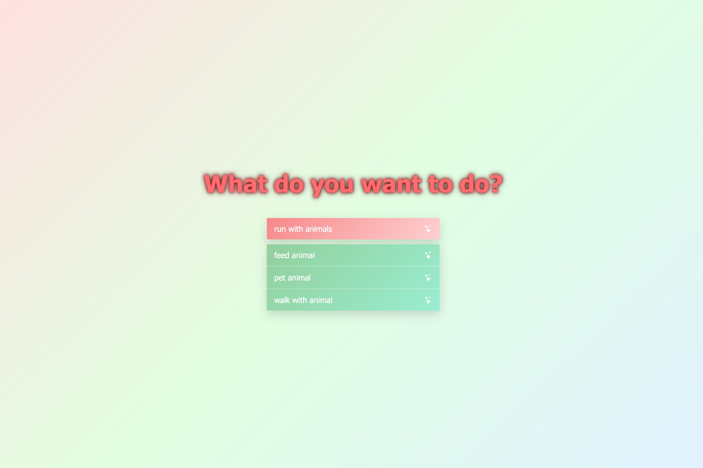
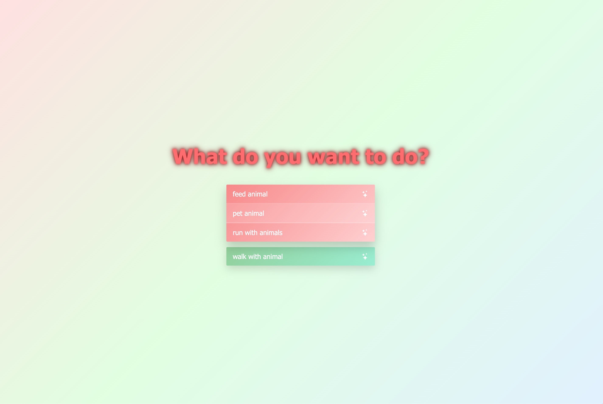

# Todo List – School Project

A simple, modern, and stylish **Todo List** built as a school project. The project uses **JavaScript**, **SCSS**, **HTML**, and some **CSS** for styling. The list is dynamic and can be managed through JavaScript. The focus is on a user-friendly interface, responsive design, and sleek hover/animation effects.

---


## Screenshots




---

## Features

- Dynamic todo list managed with JavaScript  
- Stylish design using SCSS: hover effects, centered layout  
- Responsive layout for different screen sizes  
- Bootstrap icons support for delete/check symbols  

---

## Installation

Follow these steps to run the project locally:

Clone or download the repository, and install in your terminal:

```bash
git clone <https://github.com/coraliney/todo.git>
cd <project-folder-name>
npm install
npm run build-css
npm start