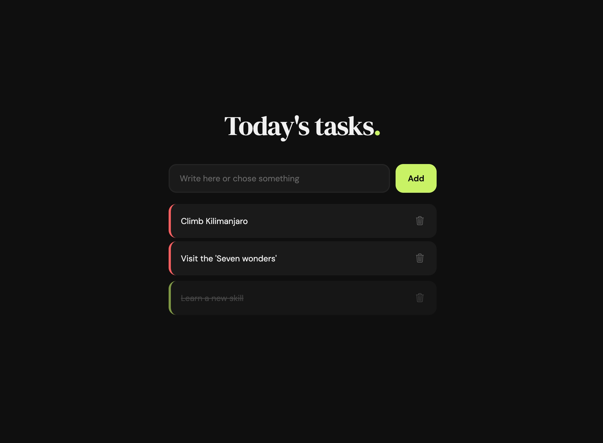

# ✅ Todo List

> A clean, dark-themed todo app built as a school project — add tasks, mark them done, delete them. Simple as that.



---

## Tech Stack

| | |
|---|---|
| **JavaScript** | Logic, DOM manipulation, class-based structure |
| **SCSS** | Styling with variables, nesting and transitions |
| **HTML** | Semantic markup |
| **Bootstrap Icons** | Trash icon for delete actions |

---

## Features

- Add tasks by typing and pressing **Enter** or clicking **Add**
- Click a task to mark it as **done** (moves to completed section)
- Click again to move it back to **todo**
- Delete any task with the trash icon
- Dark theme with smooth hover animations

---

## Getting Started

```bash
git clone https://github.com/coraliney/todo.git
cd todo
npm install
npm run dev
```

Open your browser and go to `http://localhost:1234`

---

## Project Structure

```
todo/
├── src/
│   ├── index.html
│   ├── js/
│   │   ├── index.js
│   │   └── modules/
│   │       └── class.js
│   └── scss/
│       └── main.scss
└── package.json
```

---

*School project — built with curiosity and a lot of console.log.*